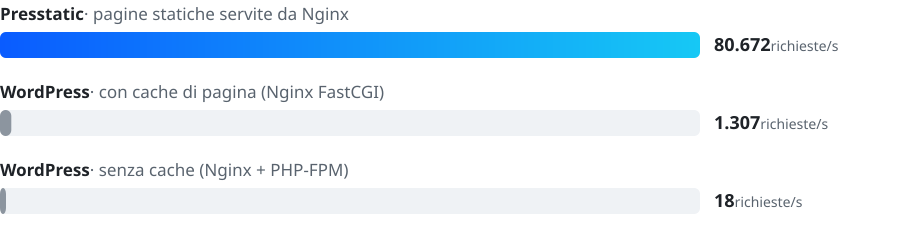
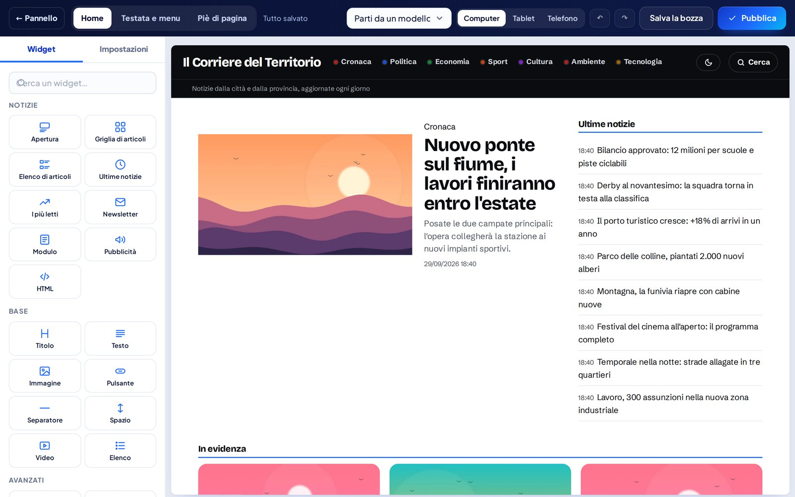
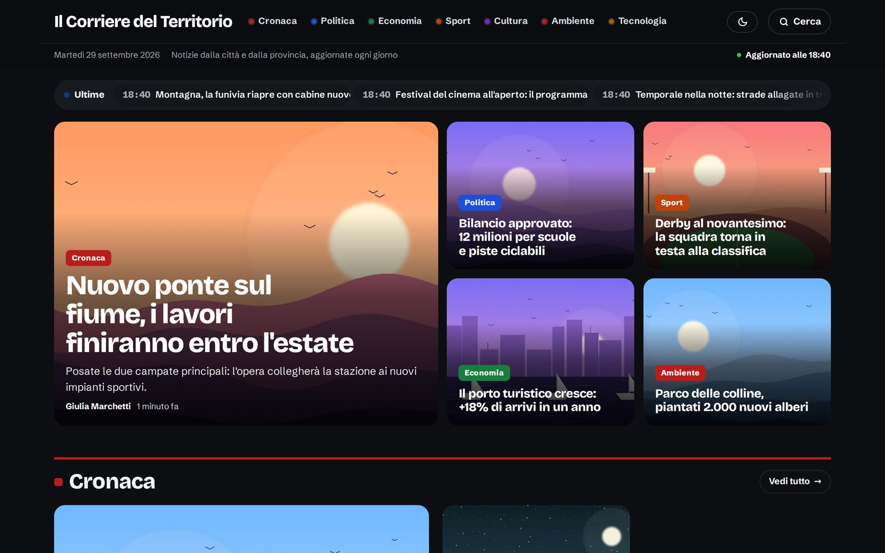
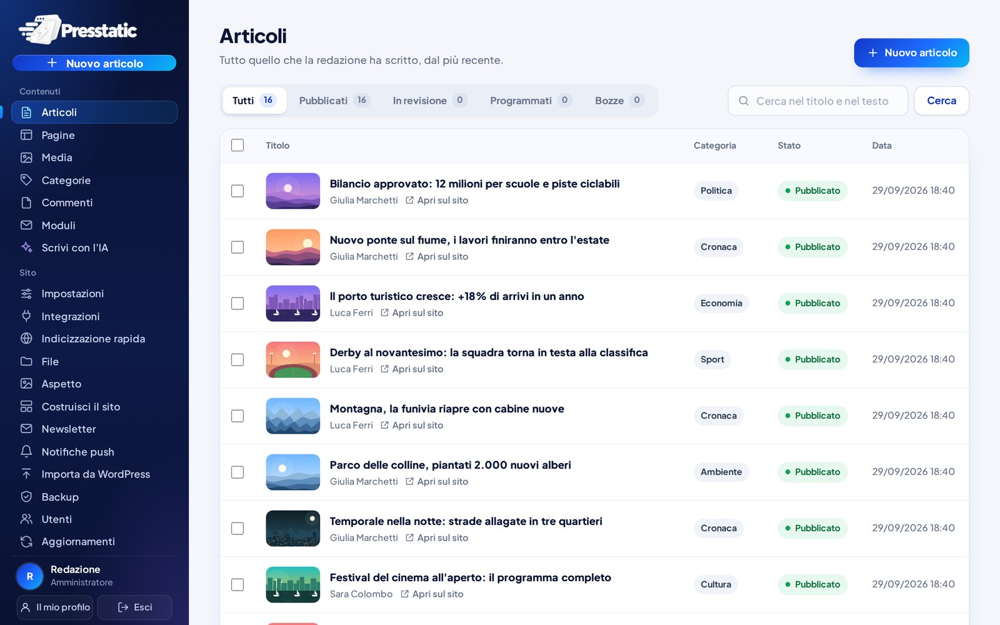
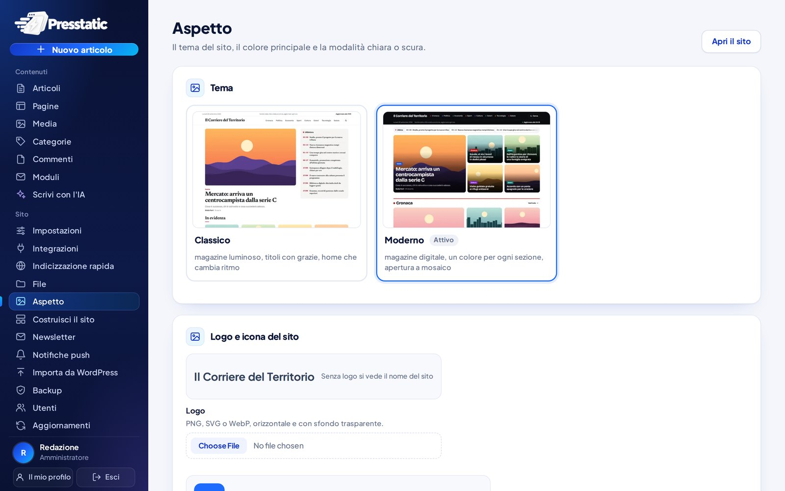
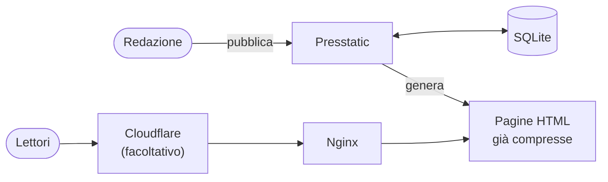

<p align="center">
  <a href="https://presstatic.it">
    <picture>
      <source media="(prefers-color-scheme: dark)" srcset=".github/assets/logo-dark.png">
      
    </picture>
  </a>
</p>

<h3 align="center">Il CMS per giornali online che pubblica pagine HTML statiche.</h3>

<p align="center">
  Veloce come un sito statico, comodo come WordPress: editor, page builder, newsletter, notifiche push
  e tutto il resto in un solo programma, gratuito e open source.
</p>

<p align="center">
  <a href="https://github.com/Presstatic/Presstatic/releases/latest"></a>
  <a href="LICENSE"></a>
  <a href="docs/SVILUPPO.md"></a>
  <a href="docs/GUIDA.md#cosa-serve"></a>
  <a href="#prestazioni"></a>
</p>

<p align="center">
  <a href="https://presstatic.it"><b>Sito</b></a>&nbsp;&nbsp;·&nbsp;&nbsp;
  <a href="docs/GUIDA.md"><b>Guida d'uso</b></a>&nbsp;&nbsp;·&nbsp;&nbsp;
  <a href="docs/SVILUPPO.md"><b>Documentazione tecnica</b></a>&nbsp;&nbsp;·&nbsp;&nbsp;
  <a href="https://github.com/Presstatic/Presstatic/releases"><b>Novità</b></a>&nbsp;&nbsp;·&nbsp;&nbsp;
  <a href="SECURITY.md"><b>Sicurezza</b></a>
</p>

<br>

<p align="center">
  
</p>

<br>

<table>
  <tr>
    <td width="50%" valign="top">
      <br>
      <b>Velocissimo</b><br>
      Le pagine sono file HTML già pronti: Lighthouse 100 in prestazioni, accessibilità, best practice e SEO, da telefono e da computer. Regge i picchi di traffico senza plugin di cache.
    </td>
    <td width="50%" valign="top">
      <br>
      <b>Sicuro</b><br>
      Chi legge non tocca mai il database. Il pannello sta su un indirizzo separato, con verifica in due passaggi, e gli aggiornamenti sono firmati e verificati prima di essere installati.
    </td>
  </tr>
  <tr>
    <td width="50%" valign="top">
      <br>
      <b>Tutto incluso</b><br>
      Nessun plugin da comprare e nessuna versione Pro: newsletter, notifiche push, commenti, moduli, banner cookie e backup sono già dentro. Paghi solo il server.
    </td>
    <td width="50%" valign="top">
      <br>
      <b>Un comando per installarlo</b><br>
      Su Ubuntu o Debian, con processori x86 o ARM, anche più siti sulla stessa VPS. Il resto si configura dal browser, con l'installazione guidata.
    </td>
  </tr>
</table>

## Prestazioni

<picture>
  <source media="(prefers-color-scheme: dark)" srcset=".github/assets/prestazioni-dark.svg">
  
</picture>

Stesso server, stessi 2.000 articoli, 50 visitatori contemporanei sulla home, pagine compresse come le chiede un
browser: Presstatic serve **oltre 60 volte** le richieste di WordPress con la cache di pagina. Anche contro WordPress
con Varnish davanti, in una serie di prove separata, ne serve il doppio: 68.475 richieste al secondo contro 33.043.
Server di prova con 1 core e 4 GB: contano i rapporti, non i valori assoluti.
[Come abbiamo misurato](tests/confronto-wordpress/README.md)

<table>
  <tr>
    <td align="center" width="33%"><h3>100</h3>Lighthouse in tutte e quattro le categorie, da telefono e da computer</td>
    <td align="center" width="33%"><h3>~4 s</h3>per rigenerare un sito di 20.000 articoli, su un solo core</td>
    <td align="center" width="33%"><h3>½ s</h3>per pubblicare un articolo, anche con 20.000 articoli online</td>
  </tr>
</table>

## Com'è fatto

<table>
  <tr>
    <td width="50%" valign="top">
      <br>
      <sub><b>Editor</b> con anteprima su Google, pubblicazione programmata e articoli in evidenza</sub>
    </td>
    <td width="50%" valign="top">
      <br>
      <sub><b>Page builder</b> per home, testata e pagine, con i widget e la scrittura direttamente nell'anteprima</sub>
    </td>
  </tr>
  <tr>
    <td width="50%" valign="top">
      <br>
      <sub><b>Tema Classico</b>: magazine luminoso, titoli con grazie e colonna delle ultime notizie</sub>
    </td>
    <td width="50%" valign="top">
      <br>
      <sub><b>Tema Moderno</b> in modalità scura: un colore per ogni sezione e apertura a mosaico</sub>
    </td>
  </tr>
  <tr>
    <td width="50%" valign="top">
      <br>
      <sub><b>Pannello</b>: articoli per stato, ricerca e azioni in blocco</sub>
    </td>
    <td width="50%" valign="top">
      <br>
      <sub><b>Aspetto</b>: tema, colore, logo e modalità chiara, scura o automatica</sub>
    </td>
  </tr>
</table>

## Cosa c'è

<table>
  <tr>
    <td width="50%" valign="top">

**Redazione**
- Editor con anteprima su Google, cronologia delle versioni, articoli programmati, note interne e azioni in blocco
- Ruoli (amministratore, redattore, autore), lavoro in contemporanea senza sovrascritture, coautori
- Libreria media con didascalie e crediti, gallerie, immagini WebP ottimizzate e dati GPS rimossi
- **Dirette**: articoli che si aggiornano minuto per minuto, con i dati strutturati delle dirette
- Scrittura assistita con l'**intelligenza artificiale** (Anthropic o OpenAI, con la tua chiave)
- Importazione da WordPress: articoli, pagine, autori, categorie, tag e immagini

</td>
    <td width="50%" valign="top">

**Sito e design**
- Due temi, **Classico** e **Moderno**, con menu a hamburger sul telefono e modalità chiara, scura o automatica
- **Page builder** visuale per home, testata, menu, piè di pagina e pagine, con scrittura direttamente nell'anteprima
- Pagina *Aspetto* con anteprime dei temi, colore, logo e icona del sito

**Lettori**
- **Notifiche push** senza servizi esterni, **newsletter** con doppia conferma e riepiloghi automatici
- **Commenti** moderati e **moduli** personalizzabili (contatti, segnalazioni) con antispam senza captcha
- Condivisione con le icone ufficiali dei social, ricerca interna, «I più letti»

</td>
  </tr>
  <tr>
    <td width="50%" valign="top">

**SEO e crescita**
- Sitemap, sitemap per Google News, dati strutturati, canonical, Open Graph, feed RSS
- Indicizzazione rapida con Google Indexing API e IndexNow, link interni automatici
- Cloudflare integrato: cache delle pagine e svuotamento mirato a ogni pubblicazione

**Pubblicità e privacy**
- Spazi pubblicitari negli articoli, tra le notizie in home e nelle categorie, annuncio fisso sul telefono, `ads.txt`
- **Banner cookie** con blocco preventivo, oppure iubenda, Cookiebot e simili, con **Google Consent Mode v2**

</td>
    <td width="50%" valign="top">

**Gestione**
- Backup automatici sul server e su archivi S3, **ripristino con un clic** dal pannello
- Aggiornamenti firmati dal pannello
- Più siti sulla stessa VPS, ciascuno con il suo database

**Tecnologia**
- Un solo programma in Rust, database SQLite in un file: niente PHP, niente MySQL
- Pagine già compresse in brotli e gzip, servite direttamente da Nginx
- Funziona su VPS e server dedicati, anche con processori ARM

</td>
  </tr>
</table>

## Come funziona



Quando la redazione pubblica, Presstatic genera le pagine come file HTML e Nginx le consegna ai lettori, con Cloudflare
davanti se c'è. Chi legge non raggiunge mai il programma né il database: le uniche richieste che arrivano a Presstatic
sono commenti, iscrizioni e moduli.

## Installazione

Serve un server Linux (VPS o dedicato) con **Ubuntu 22.04/24.04** o **Debian 12/13**, processore **x86_64** o **ARM64**,
e un dominio.

1. Punta tre record DNS all'IP del server: il dominio, `www` e `admin`.
2. Sul server lancia, con il tuo dominio e la tua email:

   ```sh
   curl -fsSL https://raw.githubusercontent.com/Presstatic/Presstatic/main/deploy/install.sh | sudo bash -s -- miosito.it tua@email.it
   ```

3. Alla fine lo script stampa un link: aprilo e completa l'installazione guidata dal browser.

Lo script scarica l'ultima versione, ne verifica la firma, installa Nginx e il certificato HTTPS gratuito. Passo passo,
con Cloudflare e le domande frequenti: **[guida d'uso](docs/GUIDA.md)**.

## Aggiornamenti

Dal pannello, pagina *Aggiornamenti* › **Aggiorna ora**. Presstatic scarica la nuova versione, ne verifica la firma e
si riavvia. L'impronta della chiave di firma è nelle [note di ogni release](https://github.com/Presstatic/Presstatic/releases).

## Documentazione

- **[Guida d'uso](docs/GUIDA.md)**: installazione, primi passi, uso quotidiano, domande frequenti
- **[Documentazione tecnica](docs/SVILUPPO.md)**: compilare, web server, Cloudflare, temi, pubblicare una versione
- **[Sicurezza](SECURITY.md)**: come segnalare una vulnerabilità in privato

## Segnalazioni e proposte

Hai trovato un errore o hai un'idea? Apri una [segnalazione](https://github.com/Presstatic/Presstatic/issues).
Per le vulnerabilità di sicurezza, invece, scrivi in privato come spiegato in [SECURITY.md](SECURITY.md).

## Licenza

Presstatic è software libero, distribuito con licenza [GPL-3.0](LICENSE): puoi usarlo gratis anche per siti
commerciali e modificarlo; chi ne distribuisce una versione deve lasciarla aperta con la stessa licenza. I componenti
di terze parti (caratteri, icone, editor, librerie) hanno le loro licenze, elencate nella
[documentazione tecnica](docs/SVILUPPO.md#componenti-di-terze-parti).

<br>

<p align="center">
  <a href="https://presstatic.it">
    <picture>
      <source media="(prefers-color-scheme: dark)" srcset=".github/assets/logo-dark.png">
      
    </picture>
  </a>
  <br>
  <sub>Fatto in Italia, in Rust · <a href="https://presstatic.it">presstatic.it</a></sub>
</p>
